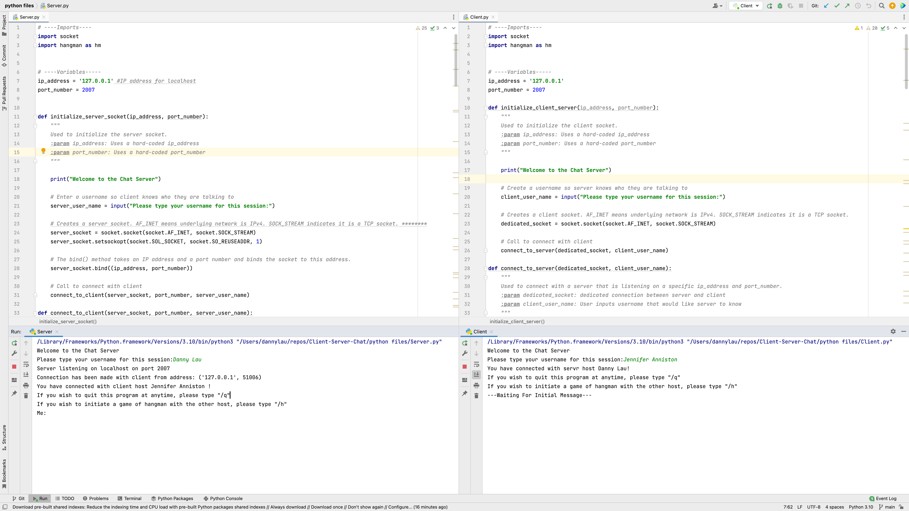
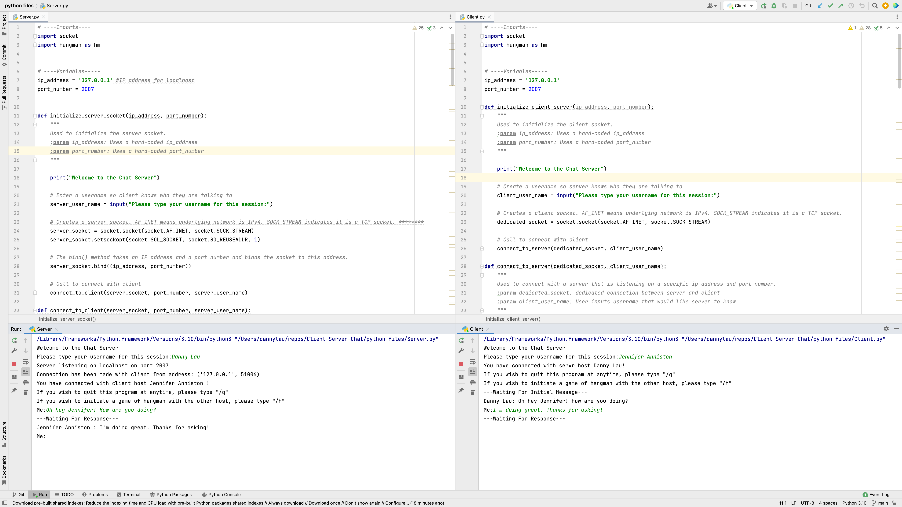
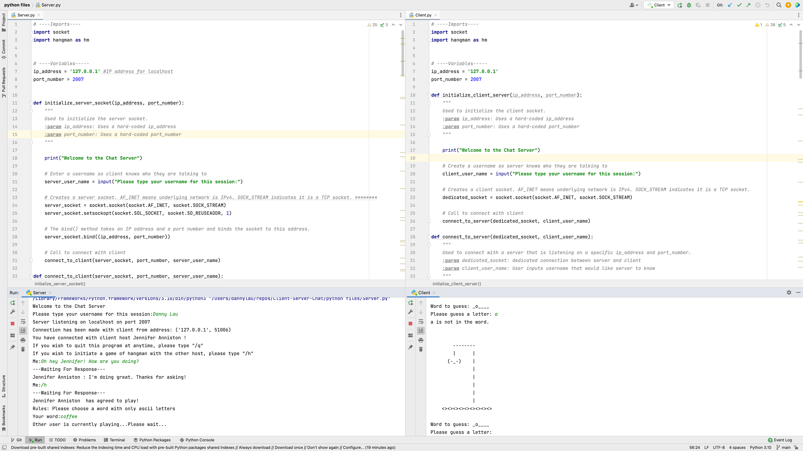
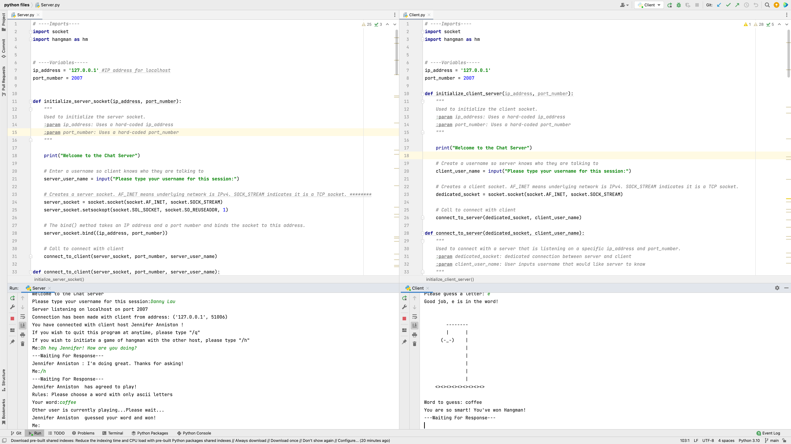
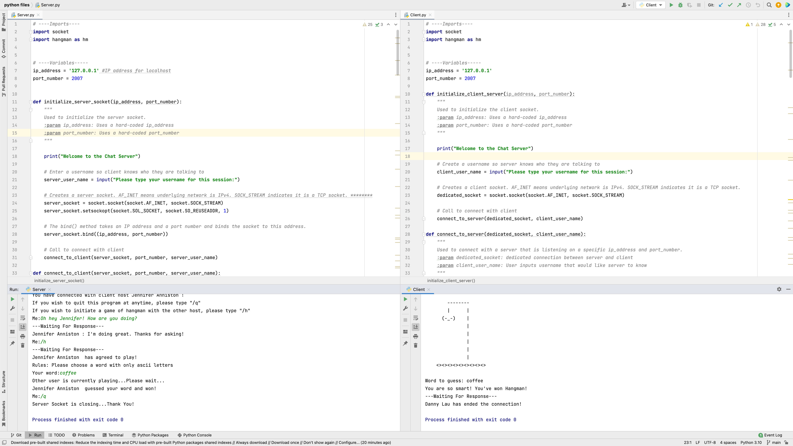

# Client-Server-Chat

## Overview

Hello all! As a computer science student, I not only get to learn programming but I also have the opportunity to learn about something I've been using my entire life: the Internet! When I see the poles and wires above my house, or when I learned about massive cables running under the ocean, or even when I received my first message on AOL Instant Messenger, I was fascinated by communication. So this past semester, I took an introductory course on Networks and learned the fundamentals of the Internet. 

For our final project, we implemented a client-server chat program written in python. Creating this program helped solidify my understanding of host-to-host communication and TCP connections between a server and client socket. This program initiates a connection between a server and client and allows a host to send a message while the other host waits to receive that message. Additionally, the program allows the two hosts to play a game of hangman. 

This program uses python's socket module.

### Server and client making a connection:

### Server and client exchanging messages:

### A friendly game of hangman:

### Hangman victory:

### Closing the connection:

